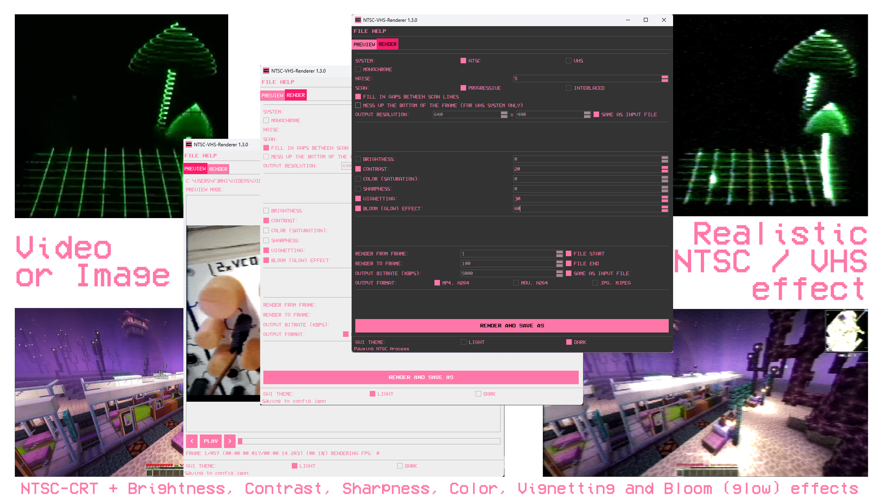

# 📺 NTSC-VHS Renderer
### Intuitive rendering and GUI for LMP88959/NTSC-CRT with effects
<div style="width:100%;text-align:center;">
   <p align="center">
      
   </p>
</div>
<div style="width:100%;text-align:center;">
   <p align="center">
      <a href="https://www.youtube.com/@F3RNI"></a>
      <a href="https://f3rni.bandcamp.com"></a>
      <a href="https://open.spotify.com/artist/22PQ62alehywlYiksbtzsm"></a>
      <a href="https://soundcloud.com/f3rni"></a>
   </p>
</div>



----------

## 📙 Dependencies

- **NTSC-CRT**: https://github.com/LMP88959/NTSC-CRT
- **BloomEffect**: https://github.com/yoyoberenguer/BloomEffect
- **FFmpeg**: https://github.com/FFmpeg/FFmpeg
- **Pillow**: https://github.com/python-pillow/Pillow
- **numpy**: https://github.com/numpy/numpy
- **psutil**: https://github.com/giampaolo/psutil

----------

## ❓ Get started

**Note**: At the moment, compiled releases are only available for **Windows x64**. To run on another platform, you must build the project from source yourself (see *🔨 Building from source* section)

1. Download latest release from https://github.com/F33RNI/NTSC-VHS-Renderer/releases/latest
2. Unzip it and run `NTSC-VHS-Renderer-X.X.X-Windows-AMD64.exe`
3. Open a video or image file by dragging it to the GUI or by clicking "File" -> "Open"
4. On "Render" tab change whatever you want. To render to a file, click the "Render and Save as" button
5. Enjoy!

----------

## 🔨 Building from source

1. Install CMake, Python and other basic building tools
2. Build NTSC-CRT for your system
   
   *Windows example:*
   ```shell
   git clone https://github.com/LMP88959/NTSC-CRT
   cd NTSC-CRT
   cmake -B build -DLIVE=off -DVIDEO=on -DCRT_SYSTEM=5
   cmake --build build --config Release
   move build\Release\ntsc_video.exe build\Release\ntsc_video_vhs.exe
   cmake -B build -DLIVE=off -DVIDEO=on -DCRT_SYSTEM=0
   cmake --build build --config Release
   ```
3. Download FFmpeg binaries from https://ffmpeg.org/download.html or build them by yourself.
   NTSC-VHS Renderer uses `ffmpeg` and `ffprobe` files
4. Download BloomEffect source code from https://github.com/yoyoberenguer/BloomEffect/tree/version-1.0.2/BloomEffect
5. Clone NTSC-VHS Renderer repo:
   ```shell
   git clone https://github.com/F33RNI/NTSC-VHS-Renderer
   cd NTSC-VHS-Renderer
   ```
6. Create virtual environment and install requirements:
   
   *Windows example:*
   ```shell
   python -m venv venv
   venv/Scripts/activate
   pip install -r requirements.txt
   ```
7. Copy NTSC-CRT binaries (`ntsc_video` and `ntsc_video_vhs`), ffmpeg binaries (`ffmpeg` and `ffprobe`) and BloomEffect source code (into `bloom` directory: `NTSC-VHS-Renderer/bloom/...`)
8. To start NTSC-VHS-Renderer: run `python main.py`
9. To build executable: run `pyinstaller NTSC-VHS-Renderer.spec`. Output files and executable will be in `dist/NTSC-VHS-Renderer-VERSION-PLATFORM` directory

----------

## 📝 TODO

- Fix output resolution (probably caused by NTSC-CRT)
- Test properly
- Build for linux
- Make it faster

----------

## ✨ Contribution

- Anyone can contribute! Just create a pull request

----------

### 🚧 P.S. This project is under development!
